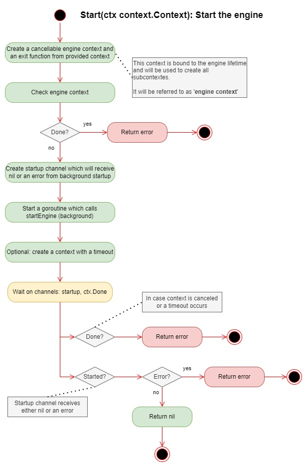

# Websocket client engine operations

The purpose of this chapter is to provide users with clear documentation of how the engine works, how it processes messages, and how it invokes user-provided callbacks.

Engine operations are divided into 6 main functions:
- **Engine start** - What the engine does when the Start method is called
- **Engine internal start** - What the engine does when it starts or restarts
- **Engine run** - What the engine does when it is running and processing messages from the websocket server.
- **Engine shutdown** - What the engine does when the engine stops (connection broken, Stop method called, exit/restart functions called or root context aborted)
- **Engine restart** - What the engine does when it restarts after being stopped.
- **Engine stop** - What the engine does when the Stop method is called

## Engine start

The engine starts when the Start method is called by the user. The Start method creates a goroutine that performs the engine internal start and waits for a signal from that goroutine to know when the engine has finished starting. The method returns when the engine has finished starting, e.g. when the engine internal goroutine has opened a connection to the websocket server, called OnOpen callback and created goroutines that will read and process messages from the server.

## Engine internal start

The startEngine private method is called when the engine is started or restarted. This method will open a connection to the websocket server, call the OnOpen callback, create goroutines to process messages, and send a signal to indicate whether or not the engine has started successfully.

## Engine run

TODO - TLDR; What the engine do to process messages

## Engine shutdown

TODO - TLDR; What the engine does when it is stopped by user (call Stop or use provided exit/restart functions)

## Engine restart

TODO - TLDR; What the engine does when it restarts when connection has been interrupted or restart function has been called by user

## Engine stop

TODO - TLDR; What the engine does when user calls Stop method